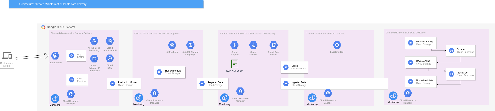

# Archived June 2022 
We will focus on building bots to detect greenwashing.

# Infrastructure
The repository  contains the configuration and code used by our infrastructure. It support the technical work
needed to deliver the climate change battle cards.

The mission is described here:

https://docs.google.com/document/d/1NiJkhbZkgGmP9ONsF8RyDivzqC8Ty6BLawENDEQLEko/edit#heading=h.v6eqrr3su5ba 

##  The scraping code
Each directory and source has its own scraping scripts.  There is a future aim to rationalise these into one 
python package. This will be located at 

https://github.com/ClimateMisinformation/scraper 

There are  three main dirs for scraping code.

1) cloud_functions
This contains the work we  are doing to migrate the  scrape scripts to  a serverless architecture. Google cloud 
functions run a scraping script and save the  output to  a bigquery table.   Because google maintain the
infrastructure it is expected to require the least upkeep by the team. For that reason it is our favoured 
option.   [more details here](cloud_functions/dailymail/README.md)

2) containers
This contains the  work done to migrate  the  scrape scripts to  docker containers. It was paused to investigate 
serverless motivated by the  difficulty  of maintaining dependencies for all the containers and the need to 
run the containers regularly  CRONJOB and maintain permanent data stores of the results without duplicates. 
Some containers are large because of the script dependencies they  use. 
They  run on your machine  after installing docker and are portable between different cloud env.  [more details here](containers/README.md)

3) scrape-scripts
These are the original scripts. They run on your machine, they  work and they save to a CSV file. Where a script uses 
selenium you  will need to install gecko driver on your machine.

## The sources
The aim is to scrape all these sources daily and save the articles in a format  usable by the  data science
team.

https://docs.google.com/spreadsheets/d/1S_pv0cFsYCdrJFp8M-Tc_Vbk221PvhtnCe-QaBr8rQw/edit#gid=0

## The  data storage
Each directory and source has its own way of storing the results.

## The architecture
This design is still in an early stage. A candidate design is shown below: 

