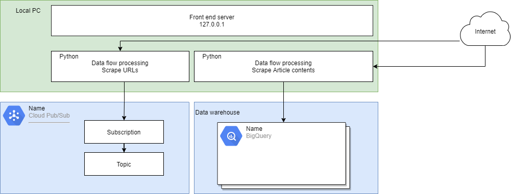

## Introduction
This document describes how to scrape a news source, "http://www.dailymail.co.uk" and store the data in a Google big query table. 
  

## Prerequisites
- A Google account
- Python 3
- Pip3
- Google Services authentication
- Chrome based browser (because Firefox stalls)

## Primer 
The components we  use and  what  we  do with them described below:
- Users PC (green)
    - We run a python scraper  based on  to collect URLs and articles from the news site.
    - Provision a server locally which invokes the scraper.
- A google cloud project (blue) 
    - We define a topic, a subscription and a data warehouse to store articles. 
    - We  use the Pub/Sub model described here: https://cloud.google.com/pubsub/docs/overview. 
    - The publisher application in our case is the scraper. It extracts the content of articles  and encapsulates them into messages.
    - The subscriber application  is a google  topic subscription. 
    - Messages are published onto a topic queue and removed if ACK is sent from the subscriber.  
    - Big Query is the data warehouse used to store the message content long term.

## Usage
Go to  https://console.cloud.google.com  and select a project. In this example my project  is called "project-id: linux-academy-project-91522". The project you select shoud be your own. You might need to create one.  This is because  you  will have the  correct permissions. Unless you request them you will not have the correct permissions on  the AI for Good   Google cloud project "eng-lightning-244220"

From https://console.cloud.google.com  Use the UI and search for pub/sub or go to https://console.cloud.google.com/cloudpubsub/

### Create a topic 
Create a topic as Step 1) In this example  the topic is called "newsarticles". 

The endpoint of the topic is:
- https://console.cloud.google.com/cloudpubsub/topic/detail/newsarticles?project=linux-academy-project-91522

The topic name is 
- projects/linux-academy-project-91522/topics/newsarticles

You do not need to define the schema of the topic.

### Create a subscription
Create a subscription as Step 2). This can be done by checking a box during create topic.

- projects/linux-academy-project-91522/subscriptions/newsarticles-sub 

The endpoint of the  subscription is
- https://console.cloud.google.com/cloudpubsub/subscription/detail/newsarticles-sub?project=linux-academy-project-91522

### Create a dataset and table
Go to https://console.cloud.google.com/bigquery?project=linux-academy-project-91522 and create a datatable. The
dataset in this example is called "my_dataset ". Its URL is https://console.cloud.google.com/bigquery?project=linux-academy-project-91522&p=linux-academy-project-91522&page=dataset&d=my_dataset 

### Create a schema for the data table
In this example the data table is called my_table. The schema for the table, so each article is :

    'name': 'url', 'type': 'STRING'
    'name': 'title', 'type': 'STRING'
    'name': 'author', 'type': 'STRING'
    'name': 'date', 'type': 'TIMESTAMP'
    'name': 'tags', 'type': 'STRING'
    'name': 'text', 'type': 'STRING' 
    
Or in Avro format

    {
      "type": "record",
      "name": "Avro",
      "fields": [
        {
          "name": "url",
          "type": "string"
        },
        {
          "name": "title",
          "type": "string"
        },
        {
          "name": "author",
          "type": "string"
        },
        {
          "name": "date",
          "type": "int",
          "logicalType": "date"
        },
        {
          "name": "tags",
          "type": "string"
        },
        {
          "name": "text",
          "type": "string"
        }
      ]
    }
    
The URI for  schema creation is   https://console.cloud.google.com/cloudpubsub/schema/list?cloudshell=true&project=linux-academy-project-91522    

If you try an import dataframes with a different schema the import fails.
with the message "Please verify that the structure and data types in the DataFrame match the schema of the destination table."
This can also appear  if no data is  present in the dataframe.

### Quickstart using the scraping tool

Go to the  root  of this repo.

    git clone
    cd infrastructure
    pip install ./cloud_functions/dailymail/requirements.txt
    python ./cloud_functions/dailymail/examples.py

You will see 

    (venv) C:\Users\richard.hill\PycharmProjects\infrastructure>python ./cloud_functions/dailymail/examples.py
     * Serving Flask app "examples" (lazy loading)
     * Environment: production
       WARNING: This is a development server. Do not use it in a production deployment.
       Use a production WSGI server instead.
     * Debug mode: on
     * Restarting with stat
     * Debugger is active!
     * Debugger PIN: 206-483-474
     * Running on http://127.0.0.1:8088/ (Press CTRL+C to quit)

    
   Open page  http://127.0.0.1:8088/
   
   A flask server will start and display "Hello world". To scrape you need to make a HTTP request to another URL on the same server.

###  How to configure the  scraper

1. Initialize  the tool 

        tool = Tool(domain_url='https://www.dailymail.co.uk/', project_id="linux-academy-project-91522", gps_topic_id="newsarticles", 
    gbq_dataset='my_dataset', gbq_table='my_table')

2. Scrape the  URLs from the  news site and filter them    

        urls = tool.collect_urls()
        filtered_urls = [url for url in urls if tool.filter_urls(url)] 

3. Publish the urls to the topic

        tool.publish_urls_to_topic(filtered_urls)

4. Subscribe to the topic and consume the URLs

        tool.subscribe_to_urls_topic()
    
5. Visit each URL and collect  the content of each article
     
        mydict = tool.collect_articles()

6. Publish the articles to a big query DB

        tool.publish_article_to_bigquery(mydict)

## Quick start

Install  the requirements using pip
    
    pip install requirements

Manually create a google project, a pub/sub topic, a big query dataset, a big query table 
    
    https://console.cloud.google.com/

Configure  the tool in the examples file to match your project

    tool = Tool(domain_url='https://www.dailymail.co.uk/', project_id="linux-academy-project-91522", gps_topic_id="newsarticles", 
    gbq_dataset='my_dataset', gbq_table='my_table')

Run the examples.py file  

    python examples.py
    
Go to http://127.0.0.1:8088/scrapeurls  a HTTP GET will cause the domain to be scraped for article urls and these added
to the topic you created. 

Go to http://127.0.0.1:8088/publisharticles a HTTP GET will subscribe to the topic  get the articles content and publish
 it to the Big Query database you created.
 
In my case this is visible at  
https://console.cloud.google.com/bigquery?project=linux-academy-project-91522&d=my_dataset&p=linux-academy-project-91522&page=dataset
 
   
