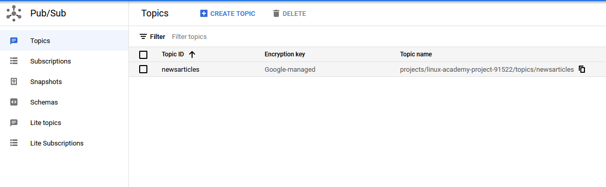
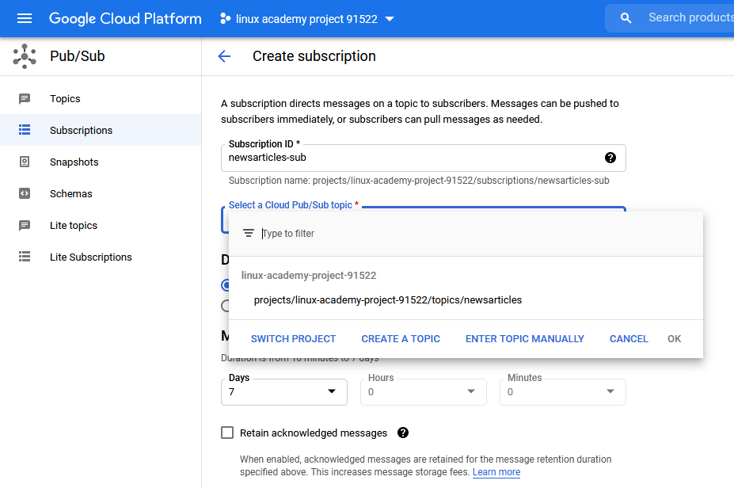
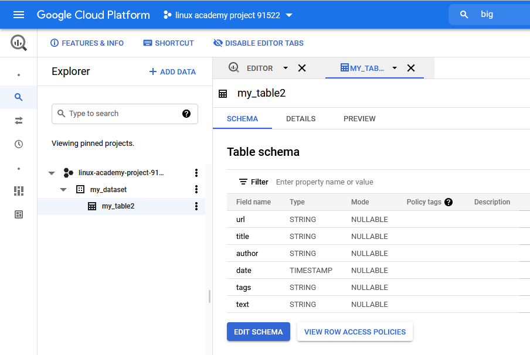
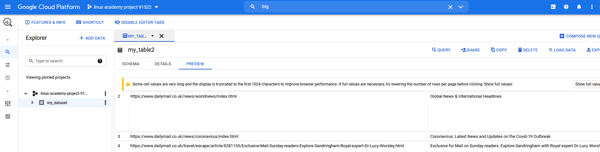

## Introduction
This document describes how to scrape a news source, "http://www.dailymail.co.uk" and store the data in a Google big query table. 
  

## Prerequisites
- A Google account
- Python 3
- Pip3
- Google Services authentication
- Chrome based browser (because Firefox stalls)

## Primer 
The components we  use and  what  we  do with them described below:
- Local PC (green)
    - We run a python scraper  based on  to collect URLs and articles from the news site.
    - Provision a server locally which invokes the scraper.
- A google cloud project (blue) 
    - We define a topic, a subscription and a data warehouse to store articles. 
    - We  use the Pub/Sub model described here: https://cloud.google.com/pubsub/docs/overview. 
    - The publisher application in our case is the scraper. It extracts the content of articles  and encapsulates them 
    into messages.
    - The subscriber application  is a google  topic subscription. 
    - Messages are published onto a topic queue and removed if ACK is sent from the subscriber.  
    - Big Query is the data warehouse used to store the message content long term.

## Usage
Go to  https://console.cloud.google.com  and select a project. In this example my project  is called "project-id: 
linux-academy-project-91522". The project you select shoud be your own. You might need to create one.  This is because  
you  will have the  correct permissions. Unless you request them you will not have the correct permissions on  the 
"AI for Good"  Google cloud project "eng-lightning-244220"

From https://console.cloud.google.com  Use the UI and search for pub/sub or go to https://console.cloud.google.com/cloudpubsub/

### Create a topic 
Create a topic as Step 1) In this example  the topic is called "newsarticles". 

The endpoint of the topic is:
- https://console.cloud.google.com/cloudpubsub/topic/detail/newsarticles?project=linux-academy-project-91522

The topic name is 
- projects/linux-academy-project-91522/topics/newsarticles

You do not need to define the schema of the topic.

### Create a subscription
Create a subscription as Step 2). This can be done by checking a box during creating topic or afterwards using the web
UI below. Make sure to select "newsarticles" as  the  topic. Use the default settings.

The subscription name is 
- projects/linux-academy-project-91522/subscriptions/newsarticles-sub 

The endpoint of the  subscription is
- https://console.cloud.google.com/cloudpubsub/subscription/detail/newsarticles-sub?project=linux-academy-project-91522

### Create a dataset and table
Go to https://console.cloud.google.com/bigquery?project=linux-academy-project-91522 and create a datatable. 
The dataset name in this example is  "my_dataset". 
 
 The endpoint of the dataset is
- https://console.cloud.google.com/bigquery?project=linux-academy-project-91522&p=linux-academy-project-91522&page=dataset&d=my_dataset 

The dataset "my_dataset" contains a datatable called "my_table2". The  datatable has a table schema which is shown on 
the screenshot.

### Create a schema for the data table
The schema for the table, so each article has the field of the types below :

    'name': 'url', 'type': 'STRING'
    'name': 'title', 'type': 'STRING'
    'name': 'author', 'type': 'STRING'
    'name': 'date', 'type': 'TIMESTAMP'
    'name': 'tags', 'type': 'STRING'
    'name': 'text', 'type': 'STRING' 
    
    
The URI for  schema creation is   https://console.cloud.google.com/cloudpubsub/schema/list?cloudshell=true&project=linux-academy-project-91522    

#### Troubleshooting

If you later try an import panda dataframes with a different schema the import will fail with the message 
"Please verify that the structure and data types in the DataFrame match the schema of the destination table." This can 
also appear  if no data is  present in the dataframe.

### Your google cloud project is now configured

## Quickstart using the scraping tool
To begin scraping articles into this google cloud project you need to run the python scraping code. The actions needed 
to do that  are described below. Follow them to import daily  mail articles into "my_table2"

### Step 1: Verify that Flask server can run locally.
This step proves that  we  have the local PC configured so that the Flask server can run  there. The Flask server will 
run the  scraping functions.

Go to the  root  of this repo and install  the requirements using pip then run the examples.py
file  

    git clone
    cd infrastructure
    pip install ./cloud_functions/dailymail/requirements.txt
    python ./cloud_functions/dailymail/examples.py

You will see 

    (venv) C:\Users\richard.hill\PycharmProjects\infrastructure>python ./cloud_functions/dailymail/examples.py
     * Serving Flask app "examples" (lazy loading)
     * Environment: production
       WARNING: This is a development server. Do not use it in a production deployment.
       Use a production WSGI server instead.
     * Debug mode: on
     * Restarting with stat
     * Debugger is active!
     * Debugger PIN: 206-483-474
     * Running on http://127.0.0.1:8088/ (Press CTRL+C to quit)

Open page  

    http://127.0.0.1:8088/. 
    
   A Flask server will display "Hello world". This proves the Flask server is running. To scrape using this Flask server
    you need to make a HTTP request to different endpoint on the same server.

### Step 2: Configure the scraper
This step configures the scraper to use the  topic, dataset, datatable you  created in your google cloud project. The 
instructions assume that you used the same values we  did above. 

Open the  cloud_functions/dailymail/examples.py in an editor or IDE. Configure  the tool in the examples file to match your project
        
    tool = Tool(domain_url='https://www.dailymail.co.uk/', project_id="linux-academy-project-91522", gps_topic_id="newsarticles", 
    gbq_dataset='my_dataset', gbq_table='my_table2')

Save the examples.py file  

    cloud_functions/dailymail/examples.py
    
### Step 3: Run the examples.py file
Run the examples.py in your python env.

    python cloud_functions/dailymail/examples.py

### Step 4: Invoke the scraping function
A HTTP GET request will cause the domain to be scraped for article urls and these URLS are appended to the "newsarticles" topic you created. 

Open a browser  or HTTP client and  GET http://127.0.0.1:8088/scrapeurls 

### Step 5: Invoke the publishing function
A HTTP GET request will subscribe to the topic  get the articles content and publish it to the Big Query database you created.
 
Open a browser  or HTTP client and  GET http://127.0.0.1:8088/publisharticles
 
### Step 6: Verify the article data is imported into the datatable. 
In my case this is visible at  
https://console.cloud.google.com/bigquery?project=linux-academy-project-91522&d=my_dataset&p=linux-academy-project-91522&page=dataset
 
   
